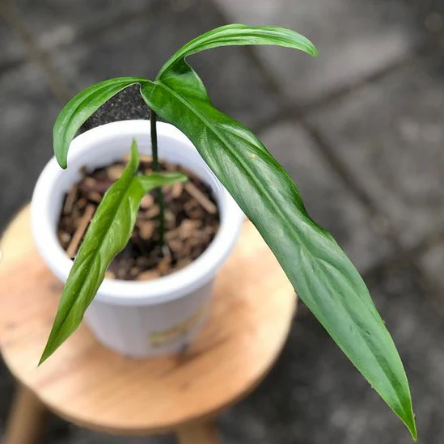
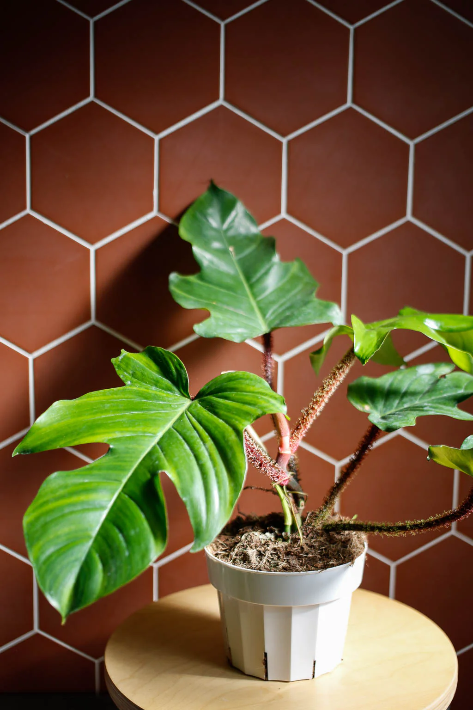

## Philodendron Joepii

Lá của Philodendron joepii có hình dạng rất đặc biệt, `thon dài` và chia thùy sâu. Các thùy có thể có hình dạng 
giống như `cái thìa`, và mép lá thường uốn lượn tạo nên vẻ ngoài rất ấn tượng.

## Philodendron Tortum

Lá: Philodendron tortum nổi bật với lá chia thùy sâu, có hình dạng rất đặc biệt với các thùy `mảnh và xoắn`. 
Lá có thể tạo ra cảm giác như các ngón tay hoặc `xương sườn`, tạo nên vẻ đẹp ấn tượng và khác biệt so với nhiều loại cây khác.

## Philodendron Holtonianum

Lá của Philodendron holtonianum có hình dạng hình `tam giác` hoặc `hơi nhọn`, thường có màu xanh đậm với các 
đường gân rõ ràng. Lá có thể có dạng hơi lượn sóng hoặc uốn cong, tạo ra một vẻ ngoài đặc biệt.

## Philodendron 69686

Lá của Philodendron 69686 có hình dạng đặc biệt với các thùy phân nhánh sâu. Chúng thường có màu xanh đậm 
và bóng với các đường gân rõ ràng. Hình dạng lá có thể giống như `hình phi tiêu` hoặc hình bàn tay, tạo nên 
vẻ đẹp độc đáo và ấn tượng.

## Philodendron Pedatum

Lá: Philodendron pedatum có lá với hình dạng rất đặc biệt, chia thùy sâu và có hình dạng giống như `bàn tay mở rộng`. 
Các thùy lá dài và mảnh, thường có màu xanh đậm và bóng. Lá có vẻ ngoài khá ấn tượng và tạo nên 
sự khác biệt rõ rệt so với nhiều loại cây khác.

## Philodendron Camposportoanum

Lá: Philodendron camposportoanum có lá hình dạng đặc biệt với các thùy sâu, thường có hình dạng `giống cô bé có 2 búi tóc`. 
Lá có màu xanh đậm và bóng, tạo nên một vẻ ngoài ấn tượng.

## Philodendron Warscewiczii 

Lá: Philodendron warscewiczii có `lá lớn`, hình dạng hình elip hoặc hình bầu dục với các `gân rõ ràng`. 
Lá có thể có màu xanh đậm, xanh nhạt hoặc có sự pha trộn của màu xanh với sắc vàng hoặc đỏ ở các gân.

## Philodendron Squamiferum

Lá của Philodendron squamiferum có hình dạng phân thùy sâu và có các thùy dài, mảnh. Các lá thường 
có màu xanh đậm và bóng, với các đường gân rõ ràng. Một đặc điểm nổi bật của loài này là các lông 
tơ hoặc sợi nhung nhỏ mọc trên cuống lá và các gân chính.

## Philodendron Bipennifolium

Lá: Philodendron bipennifolium nổi bật với lá phân thùy sâu, có hình dạng giống như `đôi cánh`. Lá 
có hình dạng phân nhánh giống như hình lông vũ hoặc cánh chim, với các thùy dài và mảnh. Lá thường 
có màu xanh đậm và bóng.

## Philodendron Jungle Boogie

Lá: Philodendron Jungle Boogie có lá lớn với hình dạng đặc biệt, thường có hình dạng giống như bàn 
tay hoặc hình `lông vũ`. Lá thường có màu xanh đậm và bóng, với các đường gân rõ ràng. Đặc điểm nổi 
bật của loài này là các thùy lá dài và mảnh, tạo nên một vẻ ngoài lôi cuốn và ấn tượng.

## Philodendron Panduriforme

Lá của Philodendron panduriforme có hình dạng rất đặc biệt, thường giống như hình `đàn guitar` hoặc 
đàn violin với các thùy sâu và không đều. Lá có thể có màu xanh đậm và bóng, với các đường gân rõ 
ràng và đặc trưng.

## Philodendron Mayoi

Lá của Philodendron mayoi có hình dạng đặc biệt với các thùy phân nhánh sâu, thường có hình dạng 
giống như bàn tay mở rộng. Các lá có thể có màu xanh đậm hoặc xanh nhạt với các đường gân rõ ràng. 
Hình dạng lá thường có vẻ ngoài giống như hình lông vũ hoặc hình đàn guitar, tạo nên sự thu hút đặc biệt.

## Philodendron Jerry Horne

Lá của Philodendron Jerry Horne có hình dạng phân thùy sâu với các thùy dài và mảnh. Chúng thường có 
màu xanh đậm và bóng, với các đường gân rõ ràng. Lá có thể có hình dạng tương tự như hình `cánh dơi` hoặc 
hình bàn tay, tạo nên một vẻ ngoài rất đặc biệt.

