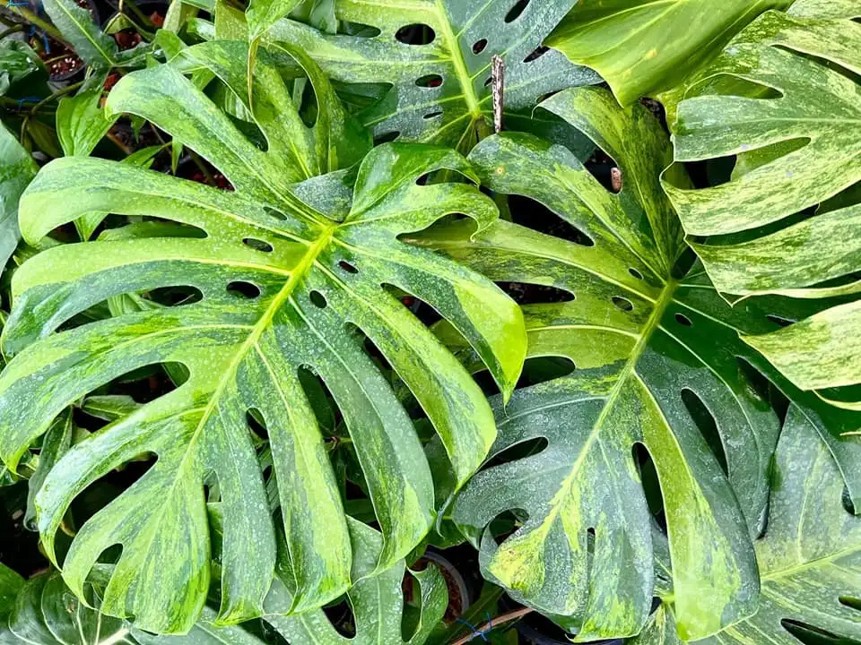

## Albo Variegata

- Monstera Deliciosa Albo variegata đột biến `màu trắng ngẫu nhiên trên lá, mảng trắng to nhỏ khác nhau`, có khi chiếm một nữa lá hoặc toàn bộ bề mặt.
- Nguồn gốc: Các khu rừng nhiệt đới Trung Mỹ, bao gồm Mexico, Panama, và Costa Rica.

## Variegata Aurea

- Monstera Deliciosa Aurea, còn được gọi là cây trầu bà lá xẻ vàng, là một loại cây cảnh phổ biến với lá có `những đốm hoặc vệt màu vàng nổi bật`. Đây là một biến thể hiếm của Monstera Deliciosa.

- Đột biến: Monstera Deliciosa Aurea là kết quả của đột biến tự nhiên, khiến lá cây có các đốm hoặc vệt màu vàng thay vì màu trắng như các loại Monstera Deliciosa Variegata khác.

## Green Snow

- Nguồn gốc: Giống như các loại Monstera khác, Monstera Deliciosa Green Snow có nguồn gốc từ các khu `rừng nhiệt đới Trung Mỹ`, bao gồm Mexico, Panama, và Costa Rica.
- Green snow (tuyết xanh) người ta còn gọi nó là Monstera White snow nếu màu `vàng chanh trên lá green snow ít`, thay vào đó là màu trắng kèm.

## White Monster

Có thể hình dung White Monster (quái vật trắng) là một cây có là `màu trắng nhưng đột biết xanh`. Nghĩa là gần như màu trắng 
là màu chính của phiến lá. Một đặc điểm thứ hai của White Monster đẹp là các mảng màu rất đều và màu trắng chiếm diện tích 
nhiều hơn màu xanh.

## Green on Green

Green on Green là một cây khá giống Aurea, nhưng chúng sẽ không có màu vàng tươi. Hầu hết sẽ là `màu vàng chanh (đọt chuối) xếp chồng` 
lên các mảng màu xanh. 

## Yellow Marilyn

Là đột biến gần giống như A`urea nhưng các mảng màu vàng có diện tích to` và phủ đều lên phiến lá.

## Oceana (Contorta)

Oceana là một đột biến về form lá hơn là màu sắc. Chúng có thể rất giống cây Albo, Aurea hoặc Green on Green.
Đặc trưng của `Oceana là hình thù lá bất bình thường`, đôi lúc hơi dị dạng cho nên mỗi cây Oceana là một cá thể duy nhất, không có cây nào hoàn toàn giống cây nào.

## Mint (Mint Monstera)

Mint Monstera là đột biến làm mưa làm gió nhất trong tất cả dòng họ Monstera bởi sự cuốn hút từ màu sắc và độ hiếm của nó.
Để dễ hình dung thì có thể nói một là Mint là một cây Green on Green nhưng sự pha `trộn giữa màu xanh và trắng rất đều và mịn` tạo nên những mảng gọi là “mint” rất ấn tượng.

## White Lava

Nếu bạn nào biết cây Colocasia White lava thì sẽ nhận ra ngay tại sao cây monstera này lại được đặt tên như vậy ngay cả khi chúng có màu đột biến yellow (vàng) chứ ko phải white (trắng).

