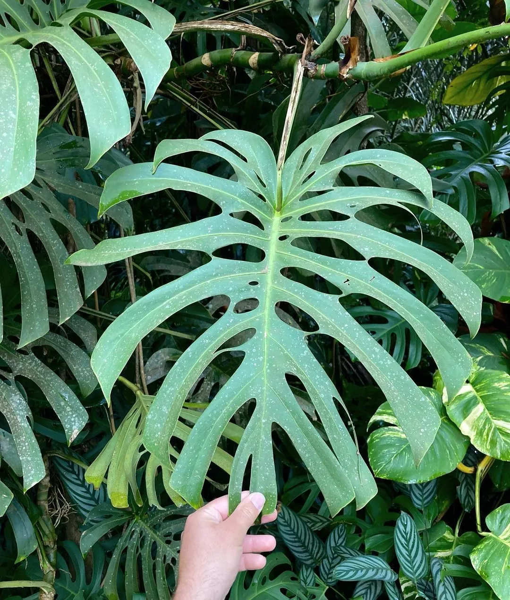
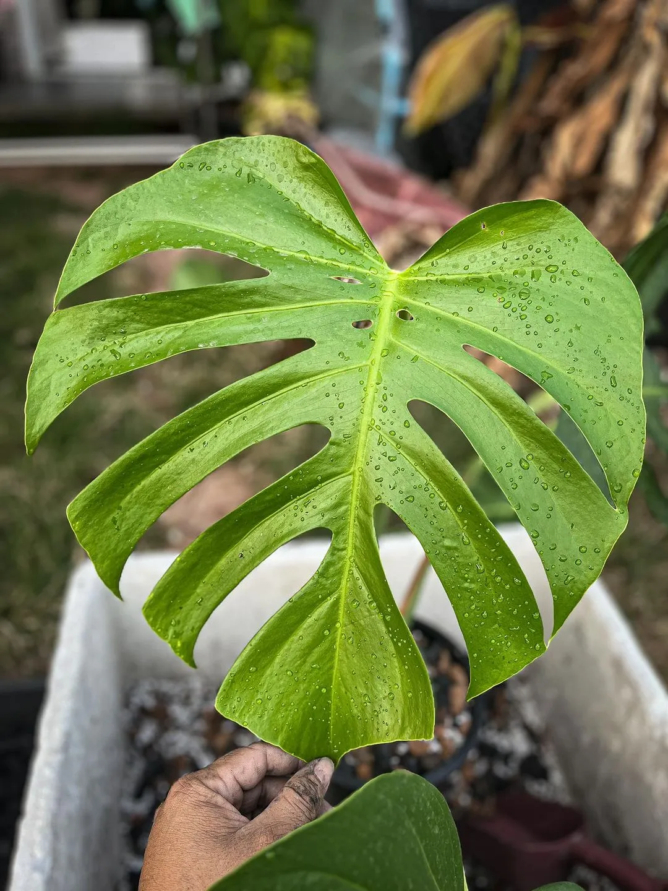
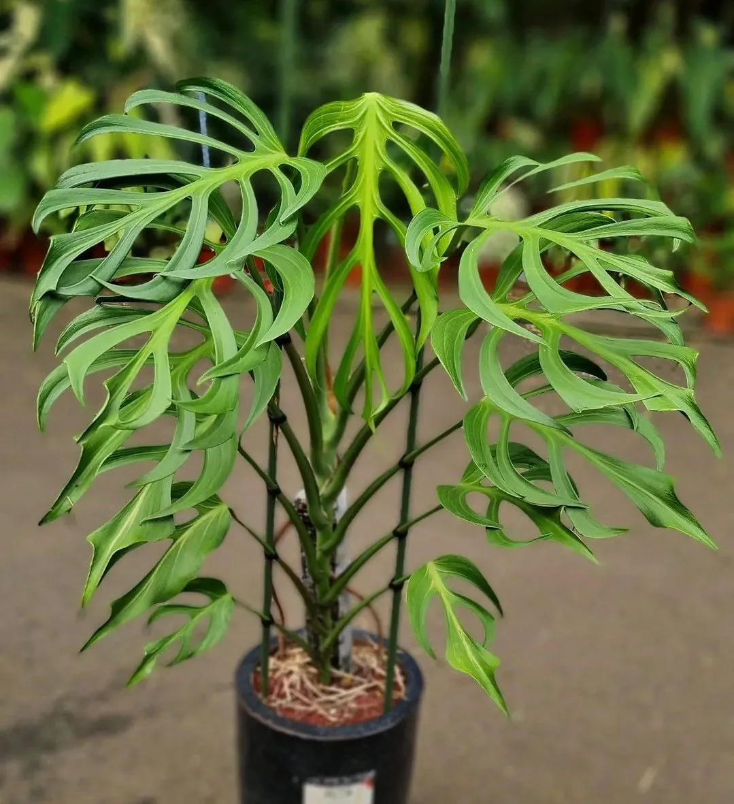
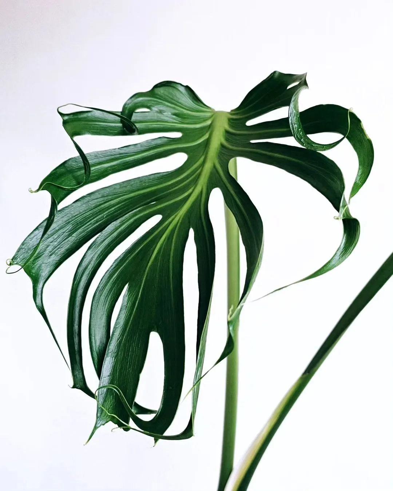

## Brazil form (Monstera Form 6)

Brazil form là một cây đột biến về hình thái lá, nghĩa là lá của chúng có hình dạng khác biệt so với bình thường.
Form 6 có lá xẻ `gọn gàng, ít lổ, các khe xẻ không quá to` tạo nên một bố cục hài hòa.

## Sierrana

Monstera Deliciosa Sierrana rất giống `Form 6 nhưng có phần đuôi lá nhọn hơn`, các rảnh xẻ to cùng với đuôi 
vuốt nhọn tạo nên dáng lá thanh mảnh. Lá Monstera Deliciosa Sierrana cũng có phần nhỏ hơn Form 6.

## ‘Burle Marx Flame’

Lá của chúng thon nhọn, các khe xẻ rất to, gần như chiếm phần lớn bề mặt lá.

## Sport ‘Unniiae’

`Ngọn lá của Monstera Unniiae thì lại uống éo giống M.Medusa`. Nhưng điểm nổi bất nhất của Unniiae có lẽ là các gân lá nổi cộm lên rất ấn tượng.

