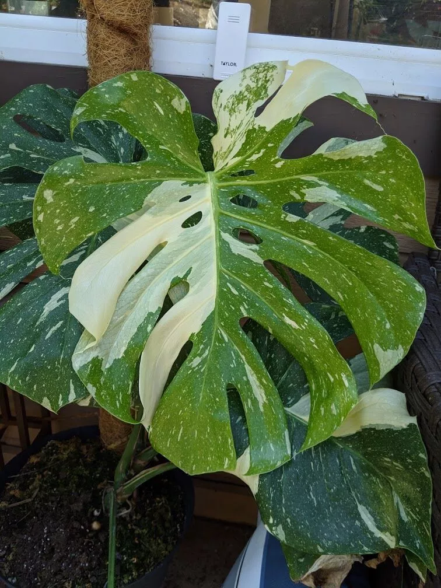
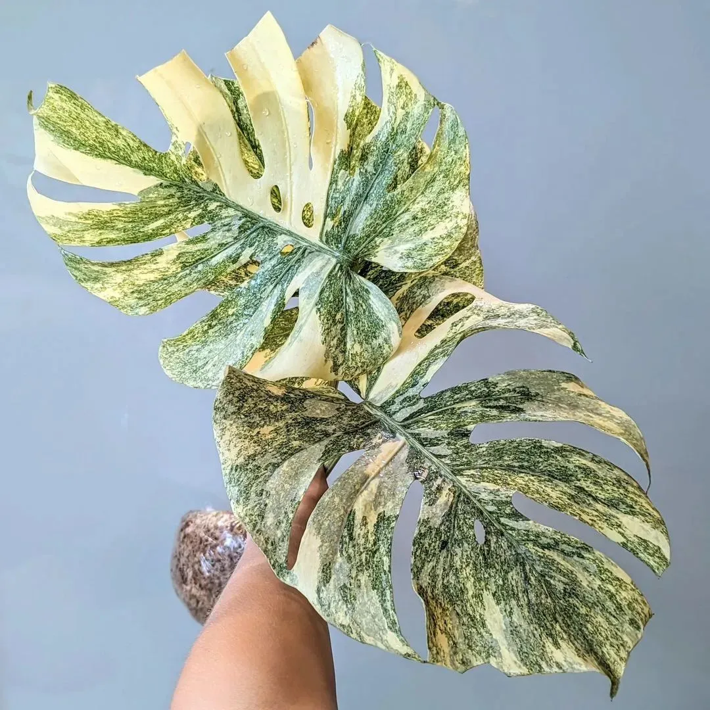

## Thai Cons

Monstera Thai Cons có nguồn gốc từ Thái Lan. Đây là một giống lai độc đáo của Monstera Deliciosa, được lai tạo để 
có những đặc điểm `vệt trắng nổi bật` trên lá.

## Thai Cons Legacy

Monstera Thai Cons được phát triển từ Monstera Deliciosa tại một phòng thí nghiệm ở Thái Lan. Đây là lý do cây được 
gọi là "Thai Cons". Sự biến đổi màu sắc độc đáo của lá là kết quả của quá trình nuôi cấy mô, trong đó các nhà khoa 
học đã can thiệp để tạo ra những mảng `màu kem đặc trưng`.

## Thai Cons Platinum 

Platinum gần như giống Legacy về cách biến đổi màu sắc nhưng màu vàng trên Platium sẽ tươi hơn.

- Nguồn gốc: Biến thể này cũng có nguồn gốc từ `Thái Lan`, giống như Monstera Thai Cons thông thường.
- Platinum gần như giống Legacy về cách biến đổi màu sắc nhưng `màu vàng trên Platium sẽ tươi hơn`.

## Thai Cons Creme Brulee

- Nguồn gốc: Giống cây này có nguồn gốc từ `Thái Lan`, giống như Monstera Thai Cons thông thường.
- Rất dễ nhầm giữa Creme Brulee và Legacy vì mật độ var trên lá nhiều, phủ đều và ổn định. Điểm khác biệt của cây Creme là var có `màu ngã vàng chuối` (vàng chanh).

## Thai Cons Yellow Star

- Nguồn gốc: Giống cây này có nguồn gốc từ `Thái Lan`, giống như Monstera Thai Cons thông thường.
- Rất dễ nhầm lẫn giữa Creme Brulee và Yellow star vì chúng khá giống. Cây Yellow star có nhiều chấm màu vàng kem và màu xanh hơi đậm khi lá già.

## Thai Cons Medusa

Cũng giống như Oceana, Medusa cũng là một loại `đột biến về hình thái lá`. Màu của chúng cũng có đốm đột biến như một cây Thaicon nguyên bản.

## Thai Cons Tricolor (Miracle)

- Còn gọi là Miracle monstera, là một cây Thaicon có 3 ‘dòng máu’ trong người: `Thaicon + Albo + Aurea`, tứ là lá có màu trắng, vàng tươi, vàng cam và cả những đốm trắng đặc trưng của một cây Thaicon.

## Thai Cons Electro Light

Electro Light là một đột biến cũng khá mới, nó thừa hưởng đốm màu của Thaicon và mảng `màu vàng chanh phủ đều tất cả bề mặt lá`. Có thể xem Electro Light là một cây Aurea + Thaicon nhưng không có màu vàng tươi.

