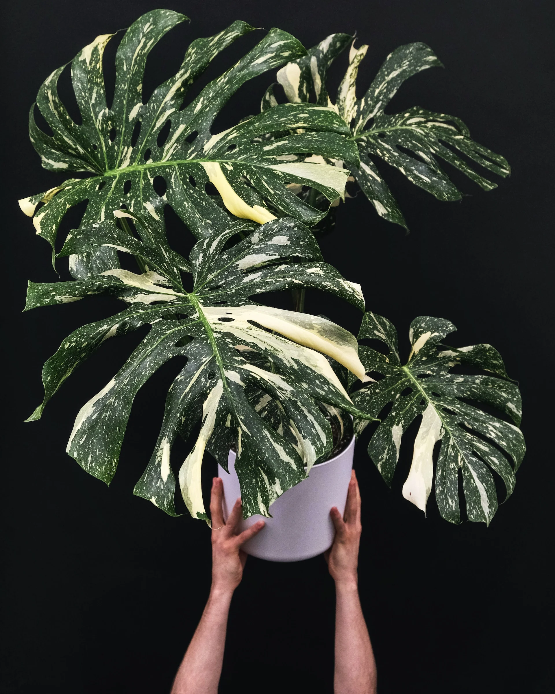
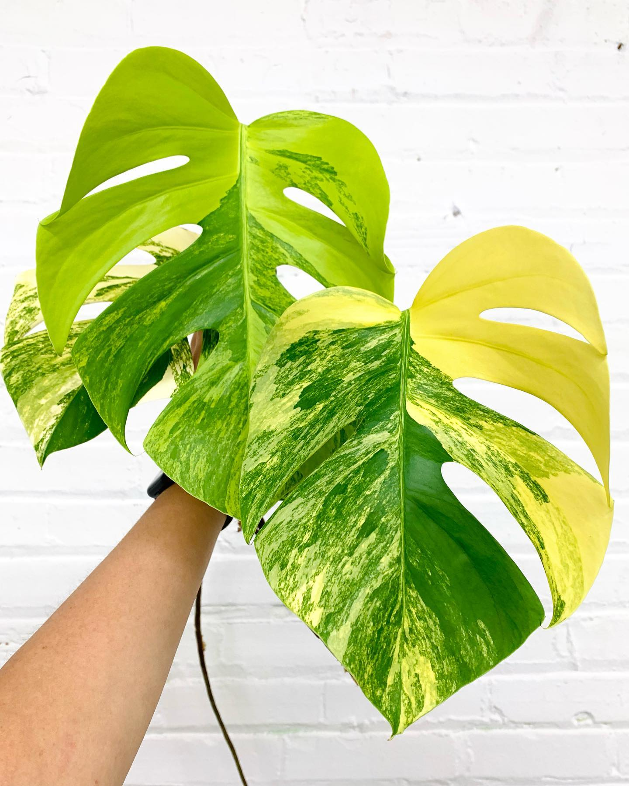
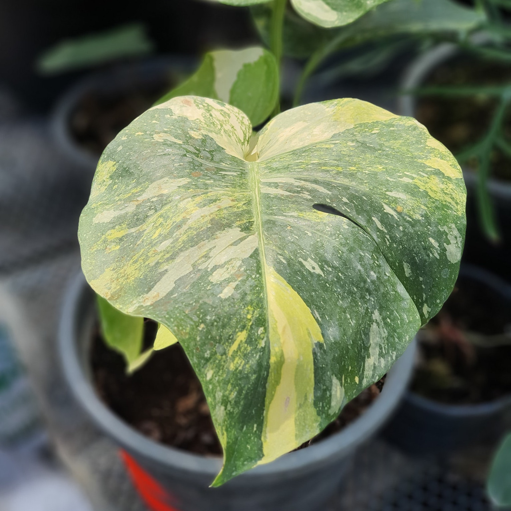

**Monstera deliciosa** cũng được biết đến với tên gọi "cây trầu bà lá xẻ" tại Việt Nam. Monstera deliciosa có thể tạo ra quả 
ăn được khi chín hoàn toàn. Quả có vị ngon, giống sự kết hợp giữa dứa và chuối. Dưới đây là một số thông tin chi tiết 
và hướng dẫn chăm sóc cây này:

## Hướng Dẫn Chăm Sóc

- **Ánh Sáng**: Ưa ánh sáng gián tiếp mạnh. Có thể chịu được điều kiện ánh sáng yếu hơn nhưng sẽ phát triển chậm hơn.
- **Tưới Nước**: Tưới nước khi lớp đất trên cùng khoảng 2-3 cm khô. Đảm bảo chậu cây có lỗ thoát nước tốt để tránh thối rễ.
- **Độ Ẩm**: Thích độ ẩm cao. Thường xuyên phun sương hoặc sử dụng máy tạo độ ẩm sẽ giúp cây phát triển tốt.
- **Nhiệt Độ**: Nhiệt độ lý tưởng từ 18-29°C. Tránh gió lạnh.
- **Đất**: Sử dụng loại đất thoát nước tốt. Hỗn hợp đất dành cho cây trong nhà hoặc hỗn hợp gồm than bùn, vỏ thông và perlite là phù hợp.
- **Phân Bón**: Bón phân cân đối, tan trong nước mỗi tháng một lần trong mùa sinh trưởng (mùa xuân và mùa hè).
- **Cắt Tỉa**: Cắt tỉa để kiểm soát kích thước và hình dáng của cây, cũng như loại bỏ các lá bị hư hỏng.
- **Hỗ Trợ**: Khi cây phát triển, có thể cần cọc hoặc cột rêu để hỗ trợ do tính chất leo của nó.

## Nhân Giống

Monstera deliciosa có thể được nhân giống qua cắt cành. Đảm bảo mỗi cành cắt có ít nhất một mắt và một lá khỏe mạnh. 
Đặt cành cắt vào nước hoặc đất để rễ phát triển.

## Các Vấn Đề Thường Gặp

- **Lá Vàng**: Thường do tưới quá nhiều nước hoặc thoát nước kém.
- **Rìa Lá Nâu**: Thường do độ ẩm thấp hoặc tưới nước không đủ.
- **Sâu Bệnh**: Cẩn thận với các loại sâu bệnh thường gặp như nhện đỏ, rệp và rệp sáp.

## Một số loại đột biến nổi bật

Monstera deliciosa có một số loại đột biến phổ biến, được ưa chuộng vì vẻ đẹp độc đáo và khác biệt của chúng. Dưới đây 
là một số loại đột biến nổi bật:

**1. Monstera Deliciosa Albo Variegata**

Monstera Albo Variegata là loại đột biến phổ biến nhất với lá có các đốm trắng hoặc vệt trắng lớn. Những vệt trắng này 
có thể xuất hiện ở mọi vị trí trên lá, tạo ra các hoa văn độc đáo và đẹp mắt.

**2. Monstera Deliciosa Thai Constellation**

Monstera Thai Constellation có các vệt trắng hoặc kem giống như các ngôi sao nhỏ rải rác khắp lá, trông giống như một bầu 
trời sao. Loại này có nguồn gốc từ Thái Lan và được lai tạo trong môi trường phòng thí nghiệm.

**3. Monstera Deliciosa Aurea Variegata**

Monstera Aurea Variegata có các đốm hoặc vệt màu vàng trên lá, tạo nên một vẻ ngoài ấm áp và rực rỡ. Màu vàng này có thể biến 
đổi từ nhạt đến đậm, tùy thuộc vào điều kiện ánh sáng và dinh dưỡng.

**4. Monstera Deliciosa Sport**

Monstera Sport là loại đột biến ít phổ biến hơn với các vệt màu xanh lá nhạt hoặc màu trắng trên nền lá xanh đậm. 
Các vệt này thường không đều và có thể thay đổi theo từng lá.

## Chăm Sóc Đột Biến Monstera

- **Ánh Sáng**: Đột biến Monstera cần nhiều ánh sáng gián tiếp để duy trì các vệt màu. Ánh sáng quá ít có thể làm mất màu đột biến.
- **Tưới Nước**: Tưới nước khi đất khô bề mặt. Đảm bảo chậu có lỗ thoát nước tốt để tránh thối rễ.
- **Độ Ẩm**: Thích độ ẩm cao. Phun sương thường xuyên hoặc sử dụng máy tạo độ ẩm có thể giúp cây phát triển tốt.
- **Phân Bón**: Sử dụng phân bón cân đối, tan trong nước mỗi tháng một lần trong mùa sinh trưởng.